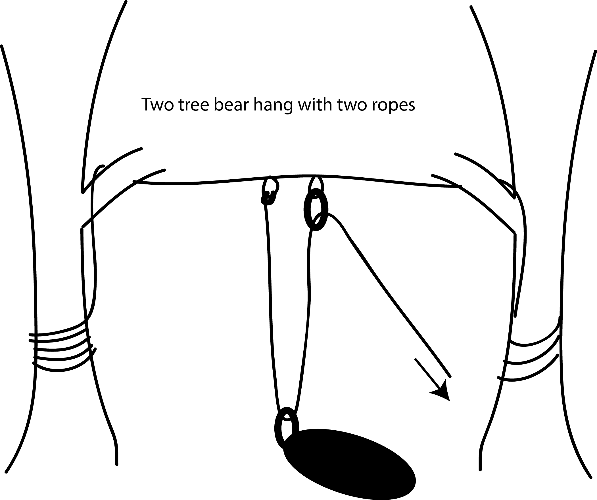

In your time as a FOP leader, you will be hiking and living within the forests of New England. These forests contain multitudes of stories, including your own. To fully appreciate such recreational areas, it is useful to consider both the long view of the landscape and the wonders that can be found today.

### A Brief History of the Northeast

With the recession of the last glacier some 15,000 years ago, the Northeastern United States emerged a rocky region filled with lakes and rivers. In just a few thousand years, it was inhabited by its first denizens. For thousands of years afterwards, these inhabitants were primarily hunters and gathers, slowly growing in population as forests changed from predominately coniferous to deciduous—the latter of which allows for greater harvest of foods such as nuts and acorns. Starting around 3,000 years ago, the Native Americans living in the area began changing forest landscapes through burning, which may have increased the amount of available habitat for the considerable variety of huntable animals that lived in the area. In addition to burning, agriculture also began changing the composition of the landscape. Up until Europeans arrived, the Native American people of the area used a technique of mobile farming -- planting maize, for instance, and then moving elsewhere to hunt and gather as the crop grew and ripened for harvest.

With European contact, land quickly became used for a more intensive agriculture. Huge swaths of old growth forest were cut down, creating a marked difference in the landscape. Some estimates suggest that between the late 1700s and early 1800s, 70-80% of New England was deforested. This means that practically all the forests that FOP traverses through are second growth, having only appeared in the last 150-or-so years. Despite this, it’s clear that most of the region is forested. That is because after the massive deforestation of the early 1800s, the later part of the century saw the start of a major resurgence. Between the mid-1800s and early 2000s, forests rebounded to cover 80% of New England, even as populations have grown! With this regrowth, previously endangered animals including moose, woodpeckers, bears, deer, and beavers have returned as well, creating the ecosystems that we see today.

An important aspect of this sustained rebound of forests has been an increase in land conservation efforts. In fact, a lot of the trails we hike on are a result of such efforts. For instance, the Appalachian Trail is an entirely protected area, providing a valuable corridor for migrating wildlife. Some regions we hike in, such as the White Mountain National Forest, are government-conserved and tend to be large tracts of lands with government-operated campgrounds and outposts. Other regions we use may have been conserved as part of a mosaic of efforts between NGOs, like The Nature Conservancy, and private landowners, which represent the future of land conservation as the majority of forests in the Northeast are privately owned. Together, these conservation efforts have led to many recreational opportunities, including FOP, for countless people to enjoy. Importantly, they allow us to experience the wonders this resilient landscape has to offer and leave us with a sense of responsibility to honor, protect, and respect such regions for the sakes of both ourselves and future generations.

### Animal Encounter Avoidance (AEA) 101

Raccoons, skunks, red squirrels, chipmunks and black bears are becoming more and more common in the areas we use for FOP. As they feed on human food, animals become accustomed to human presence and increasingly dependent on humans as a food source. As a result they become bolder, often posing a nuisance and at times a threat. Many of the above-mentioned species are currently experiencing a high incidence of rabies. Therefore, it is in your best interest to do your best to avoid animal encounters, both so that your food is not eaten or damaged and also so that the animals of northern New England do not come to rely on human food.

Remember that, while your efforts to maintain group safety by avoiding animal encounters are always paramount, you also have a responsibility to maintain the sites FOP visits. Every year this program introduces hundreds of people to the wilderness of Northern New England and, while animal encounters are rare, destruction of our wilderness areas is not. Always follow LNT principles and use common sense when taking steps to avoid animal encounters.

- Animal encounters are most likely to happen in camp, at night, and in response to the scent of food, fuel, and toiletries. Reasonable and effective steps to avoid animal encounters include hanging food and toiletries at night away from camp and keeping fuel spills away from camp.
- Select the bearbag site and set up the lines as soon as you get into camp. This will minimize the safety risks associated with after-dark bearbagging expeditions and the environmental damage that often occurs in such situation.
- Food should be at least 100 feet from both your sleeping area and kitchen, ideally upwind. (Uncertain about how far is 'far enough'? Consider how close you would want your evening visitors to you and your FOPpers.)
- Bearbags should hang 10 feet from the ground and 8 feet from any tree trunk.
- Safety comes first - it is unsafe to be without food; it is unsafe to bearbag recklessly. "You better think about what you're doin'. You better think about the consequences of your actions." - Aretha
- Make sure that all the food, toothpaste, soap, tampons, sunscreen and garbage make it into the food bags and then up, into the air. Having a bearbag is only effective if it contains everything with any scent.

### The Bearbag

There are two basic strategies for hanging food - using one tree or two trees. Each of these methods can and should be used with some sort of pulley, which will reduce friction and give you mechanical advantage. Remember that these techniques describe the elusive Perfect Bearbag. In reality, you will need to be able to adapt these methods to the circumstances in which you find yourself.

All food, garbage and toiletries should be placed in stuff sacks, which are cinched closed and secured with a clove hitch around the neck of the bag. This will ensure a degree of security of the food and will help prevent stuff sack drawstrings from pulling out. All the drawstrings are passed into a carabiner, which is clipped to the end of the rope. Ordinarily, a bearbag uses two carabiners - one for the stuff sacks and one for the pulley. (A perfectly functional bearbag can be set up without carabiners if need be. To do this, you would have to replace the carabiners with loops that you make with knots.)

#### One Tree Food-Hang

(Images from Princeton's Outdoor Action program.)

- Select a tree with a branch at least 15 feet high that will be able to support the weight of your food 8 feet away from the trunk.
- Toss one end of the rope over the branch. You can tie a water bottle or a piece of wood to the end to give it enough weight for a good throw. BE CAREFUL that no one is standing where they might be hit by the weight or the rope; make sure that everyone is paying attention to the thrower so that they can get out of the way quickly if need be.
- If the rope or weight gets stuck, try alternating between shaking with slack and pulling.

![bearbag1][bearbag1]

- Once you have the rope hanging over the branch, it is set. Make a pulley by tying a loop using a figure-eight knot (or butterfly knot) and clipping a carabiner to the loop (red carabiner in the picture).

![bearbag2][bearbag2]

- Further down on the rope towards the B end, clip the rope into the carabiner to make a loop. Clip the second carabiner (blue in the picture) to this loop and attach your stuff sacks to it.

![bearbag3][bearbag3]

- Pull on the A end of the rope to bring the pulley (red carabiner) close to the branch, but not touching.

![bearbag4][bearbag4]

- Pull on the B end of the rope to bring your stuff sacks up so that the two carabiners are close to each other, but not touching.
- Tie off the end of the rope with a friction wrap around the trunk of the bearbag tree or another nearby one.

#### Two Tree Food-Hang with One Rope

1. Select two trees, approximately 20 feet apart, with branches at least 10 feet up. These branches need not be as strong as for a one tree bearbag, as most of the pull will be horizontal, against the trunk.
2. Throw one end of the rope over a branch of the first tree. Tie the rope off, using a friction wrap, around the trunk of the tree, making sure the rope is braced against the trunk rather than the branch.
3. Attach the stuff sacks to the rope about where the center point between the two trunks will be.
4. Throw the loose end of the rope over the branch of the second tree, and guide the rope around the trunk, so that when you pull to lift, you are not pulling down on the branch as much as you are pulling against the trunk.
5. Hoist the food bags up to hang between the two trees and tie off the end of the rope with a friction wrap around the trunk of the second tree.

#### Two Tree Food-Hang with Two Ropes

This will make hoisting easier, if you have another rope.

1. Follow the steps for getting a rope over both the first and second tree branches above. Leave enough slack between the trees that most of the rope hangs at hand height.
2. Estimate where the middle of the rope will be when it is taut, keeping in mind that all the slack will be taken out of one side, not equally from both sides. At the mid-point, tie two small loops as close to each other as possible, using either a figure-eight or butterfly knot.
3. Attach one end of your second rope to one of the loops, tying it with a bowline. Take the other end of the rope and pass it through a carabiner attached to the second loop. Attach a carabiner to the large loop of rope that is created between the tied-off end and the first carabiner. This is where you will attach your stuff sacks.
4. With one person holding the second carabiner and the end of the second rope, have another person pull on the first rope so that it is as taut as possible between the two trees. Secure the end of the rope to the trunk using a friction warp.
5. Attach the stuff sacks to the second carabiner and hoist them up by pulling on the end of the second rope. Pull until the loop closes and the stuff sacks are at the pulley. Secure the second rope to a tree using a friction wrap.

#### Hoisting the Stuff Sacks

- Assign roles and talk through the procedure before beginning. Give plenty of direction while the procedure is underway.
- Two or three people help by pushing the bag up. They stand to the side of the bags (never underneath) to minimize the risk of the bags falling on them should something go wrong elsewhere.
- The rest of the group (or as many as needed) hoist the stuff sacks up, pulling the rope in the direction of the tree where it will be secured. It helps to have the pullers and the pushers working in unison, following one person's count.
- When the bag reaches the desired height, the pullers walk around the tree until there is enough friction to be secure.
- When lowering the bearbag, do not entirely remove the friction wrap initially. Instead, use the friction of the rope against the tree to slowly lower the stuff sacks in a controlled way.

### Modifications to bear bagging

If you are staying at a campsite where there is a caretaker, always check in with them to see what steps you should take to avoid animal encounters, including whether or not they are alright with bearbagging.

Many established campsites now have some kind of food storage box that can be latched closed. If there is such a device at any campsite you are using, you should definitely use it! If there are other people using the site, make sure there is enough space for them. If not, you should do a bearbag.

In the rare instance where you find no trees suitable for a bearbag or you are in particularly precarious terrain, a modified bearbag can be created similar to the ridgeline of a tarp. Have the tallest member of your group tie a ridgeline between two trees with the bearbag rope. Before attaching the second side of the ridgeline, tie as many butterfly knots as possible along the length of the rope that will be pulled between the two trees. Finish attaching the ridgeline. Using carabiners, attach the stuff sacks to the butterfly knots, spreading the food as much as possible along the length of the line. If no carabiners are available, tie the stuff sacks on using bowlines. Do not attempt to secure all of the stuff stacks to one knot in the middle of the rope, as is done in the bearbag between two trees - this will result in sagging to the point of ineffectiveness.

In the even rarer instance that your group is either ill-equipped to do a food-hang or not capable for some reason, it is still worth getting all food, garbage and toiletries out of camp in order to avoid attracting animals. Try piling the stuff sacks and wrapping them with an extra personal tarp and/or placing pots on top so that a curious animal might be frightened away by the clatter of the pots.

Remember that spilled food and fuel are common attractors of animals. Do your best to minimize these and contain them in areas where animals will not bother the group.

Consider:

- Risk of losing food to animals
- Risk of animals harming group
- Risk of environmental damage
- Risks of injury, etc. in setting up a bearbag

Prioritize:

- The most immediate threat
- The most serious threat
- Making your presence less attractive to animals

Should you go through all this just to have a bear arrive in your campsite, there are a few important things to know.
- The bear is probably just as frightened by the encounter as you!
- Stay together as a FOP trip—with numbers, you will appear larger and the bear will be more likely to leave
- If alone, back away slowly and, if the bear has spotted you, speak in a slow, calm voice
Do not go anywhere close to food (until you’re sure that the bear is gone) or to cubs that may be present
If at camp, you can get the bear to leave by ensuring it has a clear escape route with no obstacles, standing tall, and yelling at it firmly, “Get out of here, bear!”

### Dealing with Ticks and Other Bugs

As much as we like to focus on larger animals, the most dangerous fauna that you are likely to encounter is the tick. Ticks have become more abundant throughout New England as temperatures have warmed. This puts you and all of your FOPpers at increased risk for tick-borne illnesses such as Lyme disease. These diseases can last all of one’s life, making it extremely important to avoid contraction in the first place. Avoiding ticks is thus essential.

Below is a tick identification card for the ticks you are likely to find. Deer ticks (also known as black legged ticks) are more dangerous, as they carry Lyme.

![ticks][ticks] 

There are two methods for preventing ticks from attaching: physical and chemical. For physical methods, you should try to cover all areas of your body that come in contact with foliage that may harbor ticks. Try tucking pants into socks, wearing long sleeves, and avoiding walking through dense underbrush. 

For chemical methods, you can apply permethrin (or pyrethum or picaridin) to your clothes, which will kill ticks on contact. It will stay on your clothing for a few weeks/washes and will protect against bugs, especially ticks. You can also apply DEET-based bug repellents to your skin, which will also prevent ticks from biting. Apply DEET with the back of your hands and wash your hands before handling food because DEET is toxic. 

Regardless of how well you follow these steps, you also should be conducted thorough tick checks, twice daily (upon waking up and before sundown). Ensure that you check all body parts, especially under the arms, in and around the ears, inside the belly button, behind the knees, in and around hair, between the legs, and around the waist (think: dark, warm regions).

Should you find a tick unattached, you can just brush it off. If it is attached, use tweezers or a tick key to grasp it at its base and use slow, steady pressure (no sudden twisting) to pull it completely out. Do not squeeze or burn. Take a photo of the tick and save it in a labeled plastic bag to get tested later on.

### Having Safe Encounters with Other Fauna

Apart from bears and ticks, there are plenty of other animals you may encounter. For all of them, it is crucial to let them go in peace. Do not engage with them and there will be no concerns. As for worries about other fauna, such as spiders and snakes, fear not! There are no native poisonous spiders and the only two snake species of concern are critically endangered. So, hike without stress and try to enjoy any sightings you may have of the various woodland fauna.

### New England Flora

Along with the diversity of fauna, New England is also known for having lush flora. The dominant tree species you are likely to encounter on your trek are northern hardwoods, such as sugar maples, yellow birch, and American beech, as well as some conifer species, including red pine, white pine, and red spruce. For the most part, the valleys are entirely hardwood with the addition of hemlock, while the slopes contain a mixed forest of hardwoods and conifers. At the highest altitude that forests exist, balsam fir and red spruce are dominant. It might be worthwhile before leaving for your trip to look up these trees in order to point out them out to your FOPpers as you go, showing off your fantastic forestry facts!

#### Poison Ivy

The only truly concerning plant you might run into is poison ivy. This plant has some characteristic features to look out for, including: three leaves growing on individual stems, somewhat shiny, a dark green color (although, depending on the season, it may be red or a light green), and NO thorns. The picture below should help.

![poison ivy 1][poisonivy1]

![poison ivy 2][poisonivy2]

Should you or your FOPpers come into contact with this plant, wash the affected area with soap and water as quickly as possible. Since the rash will appear at different rates across the body, it gives the appearance of spreading. However, as long as the oil was washed off, it is not actually spreadable nor contagious.

[bearbag1]: http://www.princeton.edu/~oa/graphics/bearbag1.gif
[bearbag2]: http://www.princeton.edu/~oa/graphics/bearbag2.gif
[bearbag3]: http://www.princeton.edu/~oa/graphics/bearbag3.gif
[bearbag4]: http://www.princeton.edu/~oa/graphics/bearbag4.gif
[ticks]: https://www.cdc.gov/ticks/tickbornediseases/images/tick-life-stages-medium.jpg
[poisonivy1]: https://blogs.massaudubon.org/yourgreatoutdoors/wp-content/uploads/sites/20/2014/06/poison_ivy12.jpg
[poisonivy2]: https://blogs.massaudubon.org/yourgreatoutdoors/wp-content/uploads/sites/20/2014/06/poison_ivy9.jpg
