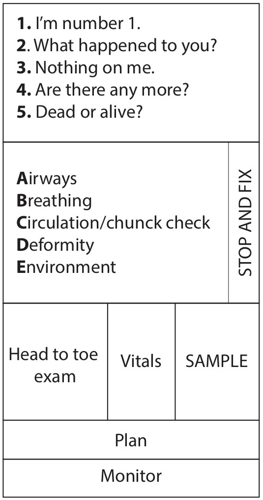

### First, ensure scene safety

Is the scene safe for:

- YOU?
- YOUR GROUP?
- ANY PATIENT?

Take steps to ensure scene safety before moving on.

### Second, manage the incident

Manage any urgent elements of the situation. Use your handbook and the medical booklet in your medkit. You may find the following references helpful:

[Wilderness First Aid](/emergencies/wilderness-first-aid.html)

[Missing Persons Protocol](/emergencies/emergency-procedures.html)

### Third, make a plan

Once you have taken steps to manage the most urgent elements of the situation, take a deep breath. No, really - you want a clear head. Okay, now start making a longer-term plan.  Potentially useful:

[Evacuation Guidelines](/emergencies/emergency-procedures.html)

[Mandatory Evacuations](/emergencies/emergency-procedures.html)

[Media Procedures](/emergencies/emergency-procedures.html)

### Fourth, communicate with basecamp

Use the contact information on the Emergency Call Guide in your leader packet. If you don't have access to that sheet, some numbers can be found in your handbook, but note that these numbers may not be the most up-to-date.

[Notification Protocols](/emergencies/emergency-procedures.html)

[Mandatory Notifications](/emergencies/emergency-procedures.html)

[Emergency Contact Information](/emergencies/emergency-contact-information.html)