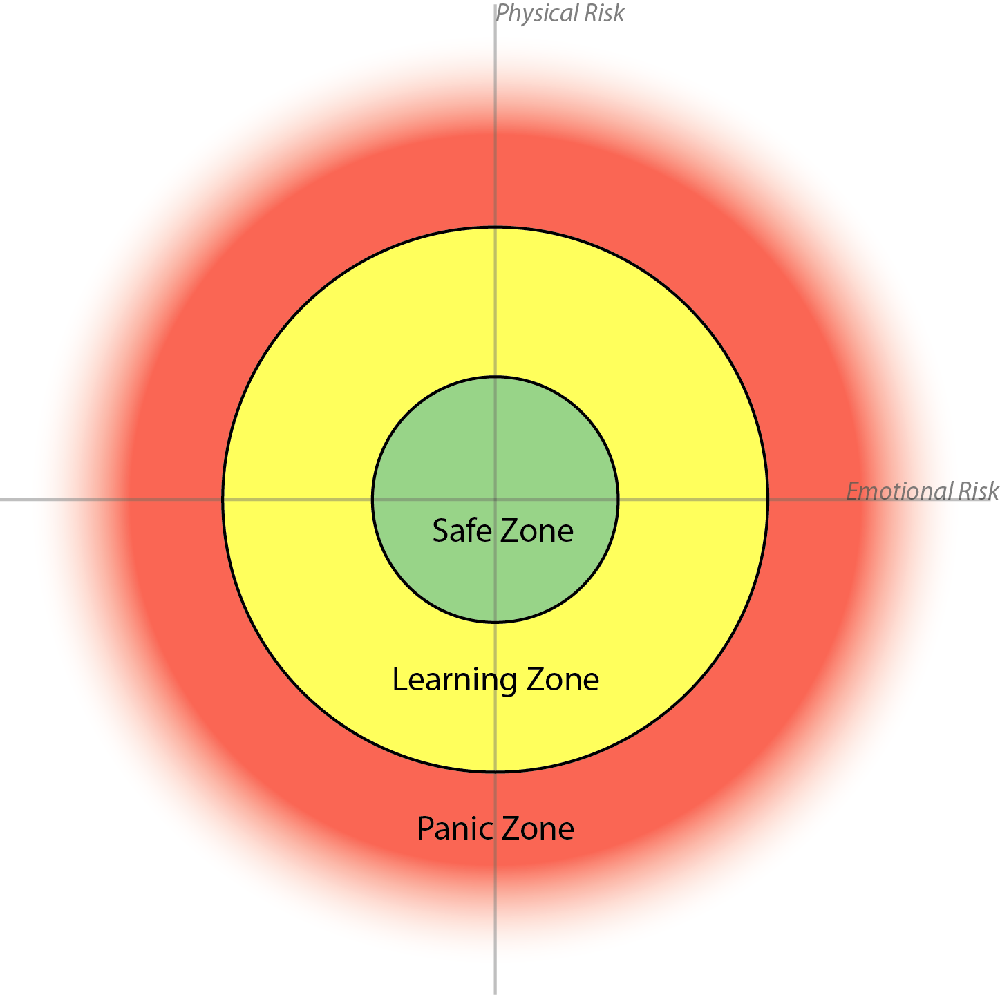

While we recognize that we cannot ensure safety on our trips, risk management is at all times the highest priority of Harvard FOP. This means that FOP leaders are expected to manage the group environment by adhering to and modeling safe procedures, teaching sound and cautious principles, and ensuring that these principles are followed. At the most basic level our objectives related to risk management are simply:

- To prevent fatalities, disabling injuries and serious illness, and to reduce the rate of other accidents, injuries and illnesses
- To provide an emotionally safe environment that ensures respect for all participants and leaders

Because of the educational nature of FOP, leaders should integrate learning about risks and managing uncertainty into every aspect of the FOPpers’ learning experiences. This responsibility begins from the first moment the FOPpers arrive at Harvard. Activities that involve risk require prudence and care in their undertaking. Risk management is not merely following correct practices; it is also an attitude to be carried into every part of a program. Unless this attitude pervades the entire program, it will be impossible to provide high-quality outdoor orientation. The following are general FOP safety and administrative practices that apply to all ability levels and activities:

- Risk management policies established by FOP apply regardless of the skill level of the participants
- Written policies provide a basic foundation for actions; conditions may warrant more restrictive practices
- Any departure from specific risk management policies must only be in emergency situations to enhance safety, and must involve a carefully developed, rational, and defensible plan

### Accident Prevention

An important element of risk management is the ability of a leader to maintain a “what if” attitude toward all aspects of the FOP experience. Group safety in unexpected situations depends heavily upon the judgment of leaders. Judgment often consists of assessing the intangible “complex set of dynamics” that make up an intuition or feeling. Be aware that many, many errors in judgment result from blindly following a schedule even when conditions indicate a need to change plans and/or from deferring to others despite one’s own concerns. Don’t be rigid about schedules, and don’t ignore your own (or your co-leader’s) misgivings about a certain situation. Remember that the “margin of safety” on our program must be greater than what you or others individually might settle for on a trip of your own. When in doubt, take the conservative course of action.

#### Why Do Accidents Happen?

An accident is "an unplanned, potentially dangerous occurrence that results in injury, property damage, or a close call (near miss)."

[Jed Williamson][williamson presentation] researched when, why, and how accidents in the outdoors occur. From his information he has suggested that we think about the potential for accidents as arising from three different categories:

- Unsafe conditions (loose or falling object, weather)
- Unsafe acts (hiking too slowly or too fast, improper clothing/equipment)
- Errors in judgment (failure to deal with a new or unexpected situation, sticking to a schedule when situation dictates you should change it)

#### The Accident Equation

In this model, potentials for causing accidents are called hazards. There are two types of hazards: environmental hazards and human factor hazards. The potential for an accident occurs when the two hazards overlap. You will always have some overlap because the environmental factor always exists. The goal is to minimize the area of overlap, where accidents occur.

![accident equation][accident equation]

##### Human Hazards

- Participants: poor skills, fatigue, trying to "prove oneself," no awareness of environmental hazards
- Leaders: poor judgment regarding safety, lack of knowledge of environmental hazards, poor teaching abilities

##### Environmental Hazards

- Rocky trails, bad water, exposed ledges, weather
- Equipment-related hazards: improper clothing, faulty stoves, inoperative equipment

***H + E = Accidents*** is one simple paradigm to consider risk; other folks have developed similar models based up the assessment of variables.

#### Risk Management and Gambling

One way to conceptualize risk is to think of your decisions as playing into a giant slot machine. Slot machines will give out different rewards based upon the way the “numbers turn up” on the windows. The lemon is a loser. Most slot machine playing may be able to tolerate a lemon here and there, but when the slot machine comes up all lemons you lose.

When on a trip, many human and environmental factors create lemons. If it is 45 degrees and raining, the environment is providing the most likely situation for hypothermia, this is one lemon. If you get out of camp late, add another lemon. You may have to enter into a ravine where an evacuation is difficult or timely if there is an accident, add another lemon. The attitude of group members, the fatigue of instructors, etc. all provide risks that may add up to a great loss.

Decisions in the wilderness are gambles. The woods are full of risks and your job is to make good bets or good decisions. Looking at the lemons carefully can give you a sense of the odds of your bet. A decision to push ahead to camp, when you have lemons such as nightfall, bad attitudes, dehydration, group conflict, and hunger all point to a disaster waiting to occur. This is a poor bet, yet leaders will sometimes play high-stakes to try to make sure things turn out the way they want. The need to push through sometimes works, but sometimes does not. Not working out can ruin many previous gains, so evaluate thoughtfully.

Remember to stop and chat with your co-leader. Pick out the lemons and consider your bet. Good leadership is working to put the odds in FOP’s favor.

### A Model for Educational Risk Taking, Beyond H + E = A

This section is from the research of Brent J. Bell and Preston Cline. It describes not only what creates risk but why we take risks and how we manage them.

The beginning stage of management is recognizing variables (like the lemons in the previous model). Only after the variable is identified can learning about it occur. In this sense, management is the conclusion of a progression of identification of risk, analysis of the risks involved (involving reflection, research, and history of results). Management is the development of a structure or system to control, influence or accept risks.

- Identify
- Analyze
- Manage

Secondly, people are vulnerable beyond physical health. When someone has broken a leg, and is bleeding, they will often worry more about how they look in front of others (social loss, fear of other people’s opinions) than be singularly concerned with being injured.

Thirdly, when an outdoor program operates by putting people at risk, it must have a clear understanding of why a participant is out in the woods. You cannot answer the question “is the risk worth taking?” in the affirmative without a conception of the purpose. Risk taking for no reason is not programmatically viable.

Risk management is a process of developing a purpose or goal for risk taking, identifying and analyzing the variables with the understanding that elimination of risk is not a possible outcome of management.

Of course, risk management in the outdoors depends highly on the judgement of leaders. It is important to recognize that this judgement is a finite resource. At a certain point a leader reaches a point called task saturation. Task saturation comes from a person doing too many things at once. If I am driving on the highway, talking on my cell phone, eating my McDonald’s meal, while merging into traffic I may be task saturated. At my present level of tasks, I may be able to function, but when one more task is added (a car stops in front of me) I may not have the ability to respond to the new task without giving up on other tasks (goodbye McDonald’s meal and cell phone call).

A way to raise the level of saturation is to form good habits. When crossing the street, I do not stop to consider how to cross the road; I have a habit I look for traffic without even thinking barely conscious of my action. Outdoor leaders need to have habits. A leader with good habits will have the ability or opportunity to consider different types of risk beyond the physical realm. If I can set up camp without thinking much about it, I am free to think about the social dynamic of the group and consider deeper ideas than how to tie the bowline.

### Risk and its General Types

Risk for outdoor programs tend to focus on physical loss, but ignores or lightly touches upon the important areas of emotional, cognitive, and spiritual risks inherent in many outdoor education programs. This is not just a problem with outdoor education, but with contemporary North American education in general.

Physical loss is important, and it is understandable why the profession came to focus on keeping people physically safe in the wilderness. Certainly, emotional and cognitive risks are less important than loss of life. In fact, a “hierarchy of needs” exists with risk. Physical risk must be managed first and foremost. Most spiritual, cognitive, and emotional risks can be recovered from, especially those within the general guidelines of an outdoor education trip, but people cannot recover from death. Once a person physically dies, growth, education and future learning are extinguished. Still, risk is important beyond the physical element because risk is essential to learning and development.

Cline and Bell propose to develop a model for risk that is educational in focus, a model identifying the fact that experiential education depends upon risk as part of its educational impact. Risk management is not about eliminating risk to the point where students cannot fail, this only creates inauthentic situations where the very power and nature of educational experience has been changed to “entertainment.” True education needs to go beyond vicarious reading of information and entertainment to the risky endeavor of changing people, of constructing new meaning, and of dealing with authentic situations.

You can think of each person as having a "safe zone" where they feel very little risk, a "learning zone" where they feel enough risk to have to adapt, and a "panic zone" where they feel so much risk that they are being hurt instead of learning. Your goal as a facilitator is to, first, keep everyone out of their panic zone, and second, to push as many people into their learning zone as possible. Keep in mind that there are multiple axes of risk (for example, physical and emotional risk) so people can move between risk zones by moving along multiple axes. For example, if you have a FOPper who is very experienced with physical risks in the outdoors, it may not be a good idea to try to push them into their learning zone on the axis of physical risk. Instead, you might try pushing them to take on more emotional risk.

### Risk Homeostasis

The idea of risk homeostasis, put forth by Gerald Wilde, is another way to think about risk zones. Wilde emphasizes the fact that people have a certain amount of risk that they are willing to take at any given time. It works like a thermostat in the sense that once a person sets their risk-o-stat, they will adjust behavior to be in line with the amount of risk a person optimally operates at in a variety of situations. For example, as cars get safer, accident rates remain the same because people will drive them faster to keep a similar level of risk.

Wilde believes we all have a unique target level of risk. The reason for the target level comes from numerous factors, but it is first influenced by cultural ideas of risk. What is considered a reasonable risk in one culture may not be reasonable in another, for instance if I invented a way to beam people to different places like they do on Star Trek, but told you it would result in a death for every x number of uses, you may balk at the cost of life, even if the cost is actually the same as it is for driving in a car, an acceptable risk in our culture. Besides culture, each person is influenced by other factors to create their own risk level.

The group also provides some influence on risk; actual research shows a lot of subtle influence on individual’s risk taking. Two examples of group influence on risk taking are the “Risky Shift” study and “diffusion of responsibility.” The risky shift describes a phenomenon where a group will be significantly riskier or safer than the “average” risk taking preference of the members. Often, a group can take actions that no individual alone would be comfortable with.

One explanation for the risky shift among groups is the feeling of diffusion of responsibility. Since a group has more people to spread out the blame, an individual in a group setting will be willing to take on more risk, or feel that the risk really does not involve them. Diffusion of responsibility is at its worst when everyone else thinks someone else is taking responsibility when in fact no one is.

Individuals therefore will develop an idea of risk optimization within a few factors (e.g. cultural influences, individual effects, group effects) that will be used to determine an optimal level of risk (the target risk) that creates a risk environment. 

Risk can be connected to performance. The performance stress curve suggests that a certain amount of stress can enhance performance, but past that can be detrimental to performance. This distinguishes between eustress, or positive stress, and distress, or negative stress. Wilde’s risk homeostasis can be viewed as the dividing line between eustress and distress for an individual. In an educational scenario, the program should include an appropriate amount of risk to optimize learning and growth, but not so much that the stress is harmful. It is important to recognize that this optimal level of risk is always greater than zero!

The risk environment lies along a spectrum from absolute safety to total loss. Each individual has an optimal point for each type of risk. In a group experience, the instructors’ goal is to set the boundaries of the experience so that each person’s risk set points are within this container. It is important to set these boundaries so the experience can be managed effectively. Of course, these boundaries have some uncertainty. For example, in the social risk of an experience, someone getting uncomfortable or getting a cold shoulder might be within the bounds of what is ok, but acts of aggression would be out of bounds. The greatest change in the model is not so much preventing more harm, but rather defining what harm is acceptable. As Keith King often says, “a broken arm on a course is acceptable with me, but a death or broken back is not” (King 1996).

Education needs risk, and risk connotes the chance for loss. Since protection from all loss would make an experience inauthentic, then a certain amount of failure and loss is depended upon by the system.

### Protecting from Loss

In the world of finances, loss is protected by insurance. My car insurance does not keep me from all loss but protects me from a loss so great I could not recover from it. Loss in educational setting is interesting because recovery from loss may actually be the most educationally beneficial aspect of the experience for a student. However, too much loss could impact both the level of risk a person is willing to take and prevent future learning and growth. If you die on a trip, no growth is going to be possible. Similarly, some losses can overwhelm any benefits included in an experience.

One of the best management tools for risk is the creation of insurance. In outdoor education, many different types of insurances can be developed to help guide the risks participants will take on a trip. The protection and the management of risk work together.

| Type of Risk 	| Protection                     	| Management Strategy                	|
|--------------	|--------------------------------	|------------------------------------	|
| Financial    	| Insurance                      	|                                    	|
| Affective    	| Self-knowledge                 	| Relationships with others          	|
|              	| Self-esteem                    	| Social support                     	|
|              	| Caring                         	| Counseling skills for leaders      	|
| Physical     	| Medical training               	| Promoting healthy behaviors        	|
|              	| Nutrition/health               	| Awareness of environmental dangers 	|
|              	| Screening                      	|                                    	|
| Cognitive    	| Support of the ideas of others 	| Cooperative group discussion       	|
|              	| Research                       	|                                    	|
|              	| Culture that accepts mistakes 	|                                    	|
| Social       	| Cooperative group              	| Set up cooperative group           	|
|              	|                                	| Deal with mistakes and conflict    	|
|              	|                                	| Group Contracts                    	|
| Spiritual    	| Faith community                	|                                    	|

So, the work of risk management is to consider a numerous amount of risk variables and place students in an environment where risk is allowed, but management of the risks is accomplished through the thoughtful consideration of the purpose. Managing risk goes beyond the physical, which is helpful to our most physical FOPpers, since we can challenge them in different ways, such as having them take personal and social risks, rather than staying in the environment where they have the most success and the least learning. In all, it is up to the leaders to figure out what they will contain within the already defined bounds of FOP.

### Accountability

Your training process as a FOP leader is designed to enhance the good judgment and common sense that we look for in trainees, so that you are fully prepared to go into the field with a group of students. The handbook is designed to serve as your guide to responsible leadership, and we expect you to follow FOP policies. However, the wilderness is an isolated environment where situations beyond your experience and control can occur. Special circumstances may arise in which reason and judgment dictate that you break with FOP policy. Any departure from specific FOP directions should only be used if it involves a carefully developed, rational, and defensible plan. Accountability translates for FOP leaders into an ongoing commitment to clear, honest communication and a willingness to engage in questioning and evaluation. It is an openness to learn from our mistakes, to take credit for our successes, and, in all cases, to think critically.

Leaders are accountable to the University, to the FOP Director, to the Steering Committee, and to each other. This does not translate into telling each other what to do, but rather into knowing more about each other and being able to share the responsibility with each other. The important point to keep in mind is that the more we talk, the more we give each other feedback; and the more we help each other and combine our strengths, the more effectively we’ll be able to manage risks on our trips.

### Emotional Safety

Emotional safety is in some ways a less clearly defined subject than actual physical safety. The perception of one's own physical safety can affect one's emotional safety, however, and a lack of emotional safety can profoundly affect an individual or a group. Maintaining the emotional safety of the group can be much harder than maintaining the group's physical safety  we have the FOPpers' medical records, but there's still a lot we don't know about their histories.

- Be sensitive. You and your co-leader(s) should monitor the group, watching for changes in behavior - subtle or abrupt - that occur in response to events.
- Create a safe, supportive environment for all FOPpers and leaders. Work with your co-leader(s) to make sure everyone is comfortable in the group.
- Give people their space. An encouraging touch on the arm or shoulder might not bother a FOPper, but a back rub could be too much for someone to handle. Don't assume everyone is as comfortable with physical contact as you might be.
- Follow FOP guidelines regarding group dynamics. Look at the policies regarding alcohol, drugs, and sex, and read the section on outdoor leadership.
- Maintain an open and tolerant atmosphere. Remember that FOP aims to foster an open and tolerant atmosphere where people are willing to work with each other regardless of differences such as gender, age, race, sexual orientation, religion, ethnic or socio-economic background.

[williamson presentation]: http://www.nols.edu/nolspro/pdf/AccidentsinOutdoorPursuits_TheirCausesandCures-Williamson.pdf
[accident equation]: http://www.princeton.edu/~oa/graphics/dynaccid.gif